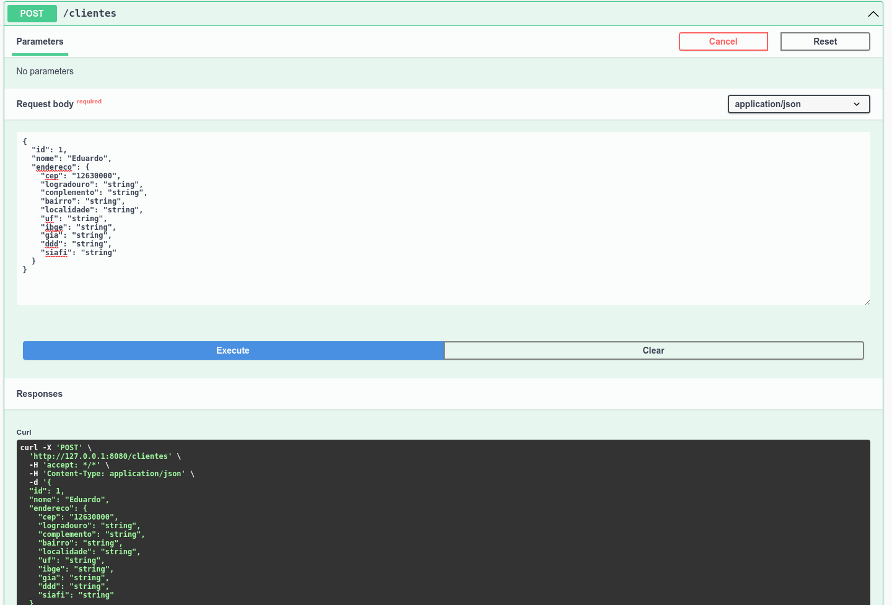

# Desafio de Projeto: Explorando Padrões de Projetos na Prática com Java

Desafio de Projeto do **Bootcamp  GFT START #5 JAVA**, promovido pela [Digital Innovation One](https://www.dio.me).

## Descrição do Desafio

Agora é a sua hora de brilhar! Crie uma solução que explore o conceito de Padrões de Projeto na pŕatica. Para isso, você pode reproduzir um dos projetos que criamos durante as aulas ou, caso se sinta preparado, desenvolver uma nova ideia do zero ;-)

**Desafio:** Explorando Padrões de Projetos na Prática com Java

***Tela da API e POST sendo feito***

