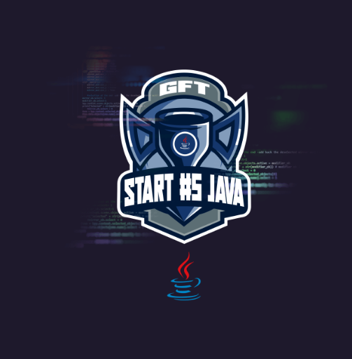
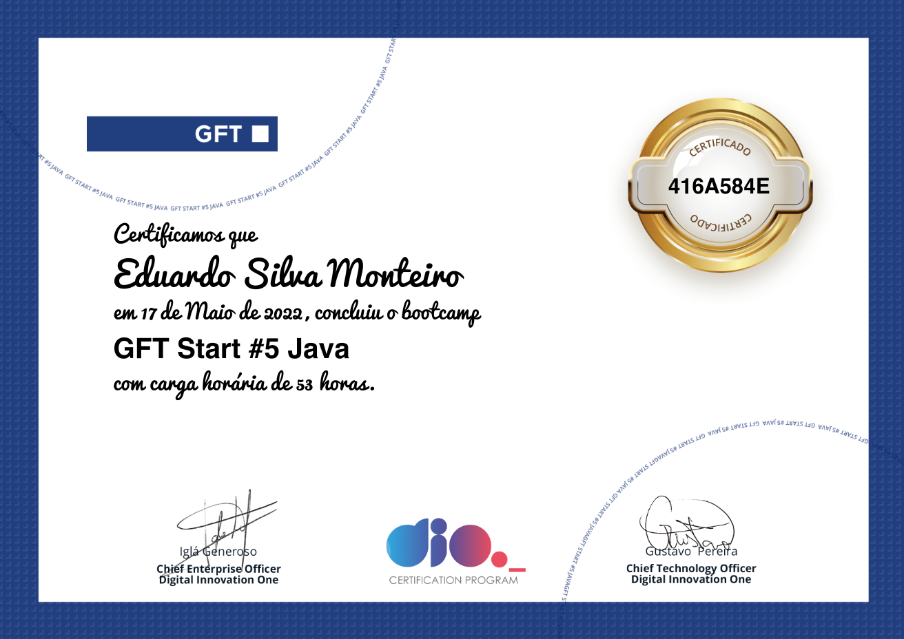

# Bootcamp GFT Start# 5 Java
Códigos e Conteúdos do **Bootcamp GFT Start# 5 Java**, promovido pela Digital Innovation One.

O **Bootcamp GFT Start# 5 Java** é um programa gratuito para formação e recrutamento de estagiários pela GFT.
O programa explora uma trilha completa em Java para pessoas regularmente matriculadas no ensino superior e contém cursos, desafios práticos e mentorias exclusivas com experts da multinacional. 

**Conclusão do Bootcamp:** 17/05/2022

